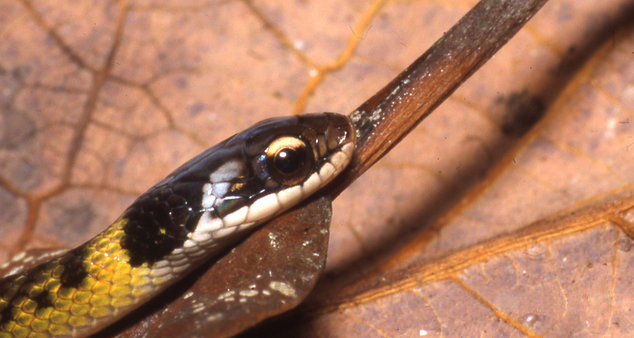

## _Colombian biologist interested in evolutionary biology, herpetology, science communication and inclusion/diversity/equity in STEM_

**Complete information in Spanish/ Información completa en español [aquí](./Spanish_content/index_es.md)**

### About me

My main research interest is understanding the evolution of traits generated by interactions between organisms, especially by the predator-prey interactions, mostly in amphibians and reptiles. I am also interested in the evolution of toxicity resistance and the genetic basis of neurotoxin resistance. On the other hand, I like to contribute to science communication in Spanish and diversity in STEM. 

Check on my complete [curriculum](./curriculum.md) and in Spanish [aquí](./Spanish_content/curriculum_es.md)

I work with an excellent group of scientists lead by Rebecca Tarvin. For more information go to [Tarvin lab](https://www.tarvinlab.org/).

### Active research interests

- Adaptations to new environments or novel interactions among organisms increases biological diversity. One type of interaction that often drives biological diversification is predator-prey interactions, which could result in co-evolution between different organisms adjacent in a food web. For my PhD, I am working with snake predators of poison frogs in Colombia to evaluate how multiple predators have adapted to feeding on a cocktail of toxins (poison frogs secrete multiple alkaloids).
 _Erythrolamprus reginae. Photo: Andreas Schlüter CC BY-SA 2.5_

- These trends likely generate a global gap in scientific productivity. to understand and generate alternatives to the effects of the hegemony of English in the sciences.
English, then, influences the individual "success" of a researcher, but it also has an effect at a more global and collective level, since there is a strong correlation between English proficiency, economic development and technological innovation in terms of number of articles, number of investigations and research and development expenses (EF Education, 2018). It also affects the relationship between science and society, by limiting the already minimal scientific communication with institutions and local communities, and by disassociating science learning from local culture, reinforcing the idea that science is alien to our territories and our life experiences (de Vasconcelos, 2006). The hegemony of English deepens the inequality in the production and use of scientific knowledge in countries with low English proficiency. This delimitation and Anglo-centric construction of science reproduces the colonial relationship of extraction, dependence and use of knowledge, that is, it maintains a gap between the countries of the global or peripheral south and the countries of the global north (Flowerdew, 1999; Alves & Pozzebon, 2014; Curry and Lilis, 2017, Hanauer et al., 2019).

.jpg)

For past research interests, check on my [curriculum](./curriculum.md).

### Contact
email: vramirezc [at] berkeley [dot] edu

twitter: [@Valeria_RamCas](https://twitter.com/Valeria_RamCas)

*Always willing to collaborate and start new projects. Do not doubt to contact me!*
